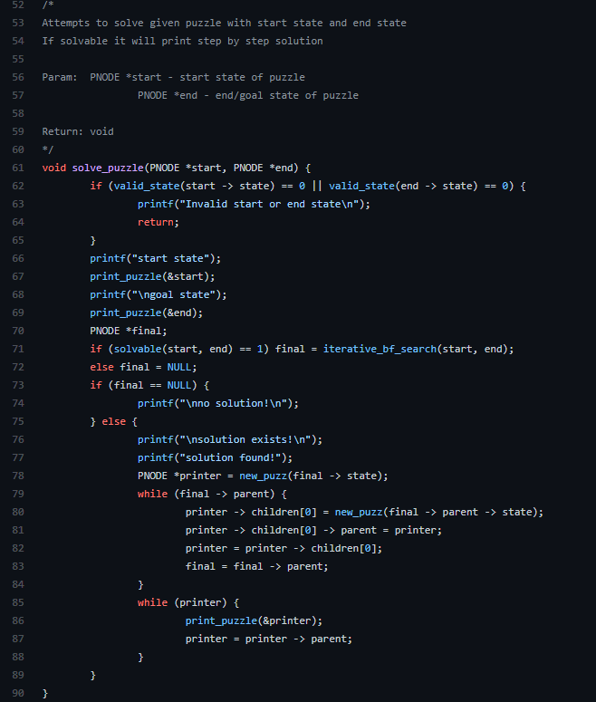

A 8-Puzzle solver that uses the DFS algorithm. This was an acadmeic bonus project programmed using C. Could solve 8 block puzzles.

<!--more-->

The code for this project can be found on my github or by following this [link!](https://github.com/DerekMarshall855/8PuzzleSolver)

---



