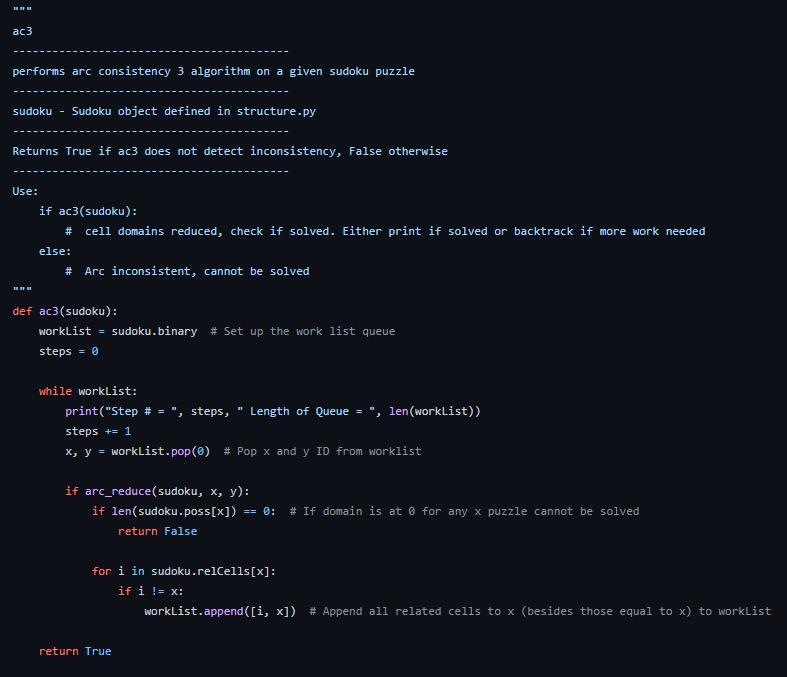

A Sudoku puzzle solver that uses the AC3 algorithm. This was an acadmeic project programmed using python.

<!--more-->

The code for this project can be found on my github or by following this [link!](https://github.com/DerekMarshall855/CP468-Assignment-2)

---



