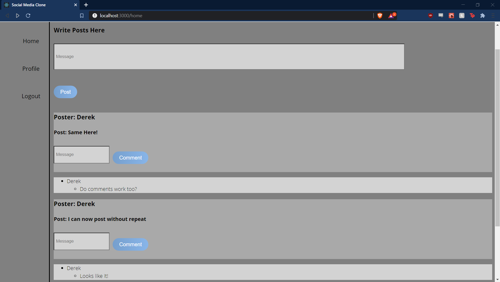

A basic blog site that was inspired by twitter. Displays a vertical menu and has built in authorization and authentication. User can make and comment on posts if they are logged in. Has a backend API designed and implemented using MongoDB, ExpressJS and NodeJS. This was the last project I did before commiting to better my CSS, which is obvious by the bland layout.

<!--more-->

The Blog Site is not currently hosted on any service. This was one of my first solo projects and I did not fully understand how to host full stack applications during this period. The code for this project can be found on my github or by following this [link!](https://github.com/DerekMarshall855/social-media-clone)

---



